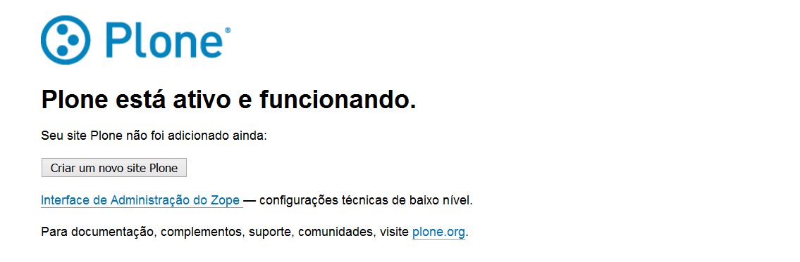
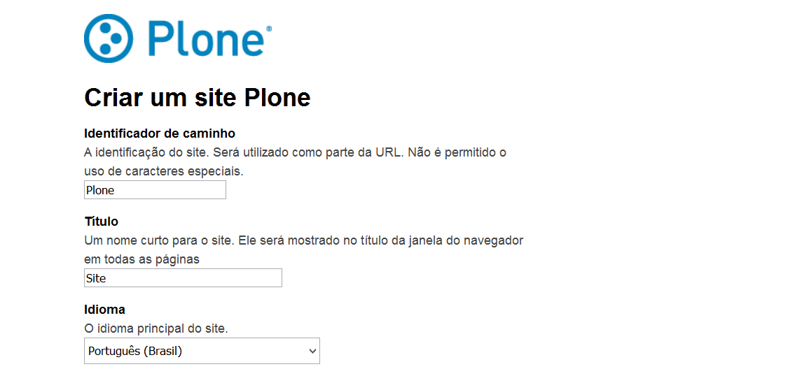
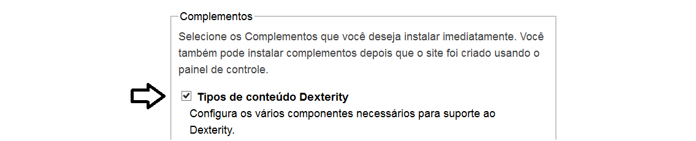
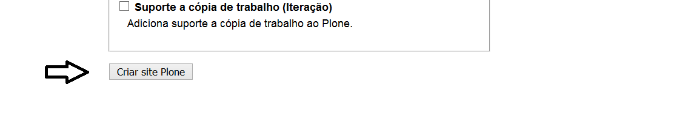
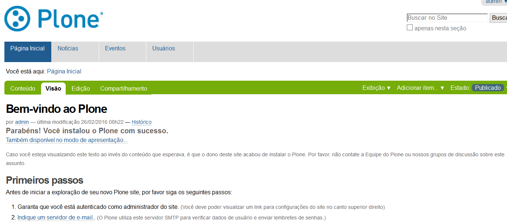
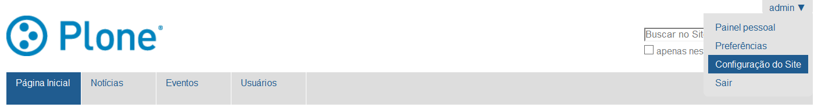
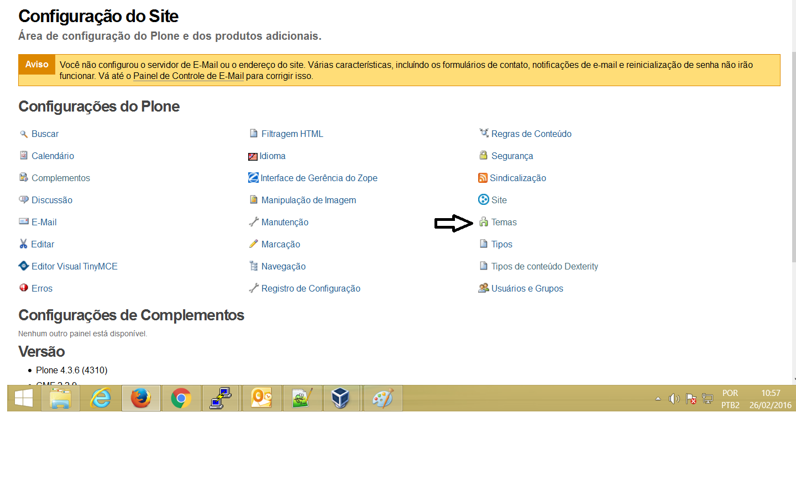
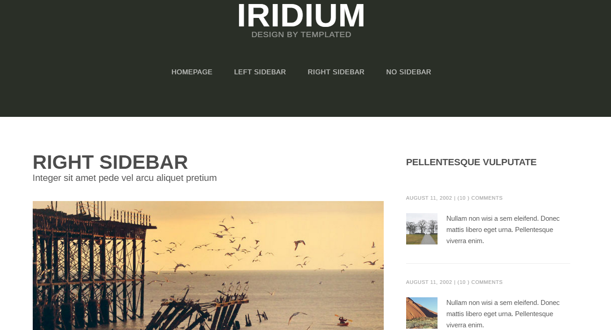

====================
Exemplo de tematização do PLONE
====================

Plone é um sistema de gerenciamento de conteúdo (CMS, de Content Management System) escrito na linguagem Python e que roda sobre um Servidor de Aplicações Zope e sobre o framework CMF (Content Management Framework).

====================
Introdução
====================

Este plugin serve para demonstrar como se instala, via BUILDOUT, o PLONE, versão 4.3.3. Além disso, contém um exemplo prático de customização de leiaute do portal.

====================
Como instalar
====================
Neste plugin, foram feitos testes na distribuição CENTOS, versão 7. Caso você utilize uma distribuição diferente, reveja a síntaxe de alguns comandos apresentados aqui. 

  yum groupinstall 'Development Tools'
  
  yum install nmap mod_ssl openssl openssl-devel zip unzip zlib-devel bzip2 bzip2-devel readline-devel sqlite sqlite-devel libxml2-devel   libxslt-devel python-setuptools wget
  
  mkdir projetos
  
  cd projetos

Baixar o projeto do git (plone.limpo)

  git clone https://github.com/wagnerwar/plone.limpo.git
  
  cd plone.limpo
  
  wget https://raw.githubusercontent.com/buildout/buildout/master/bootstrap/bootstrap.py
  
  python bootstrap.py
  
Criação do arquivo sources.cfg (Configuração necessária para inclusão deste plugin na instalação)

  [buildout]
  
  extensions += mr.developer
  
  always-checkout = force
  
  auto-checkout =
  
      plone.custom
      
  [sources]
  
  plone.custom = git https://github.com/wagnerwar/plone.custom.git
  

Edição do arquivo buildout.cfg

Inclusão da referência do plugin na propriedade ‘extends’, para que o buildout consiga ler as configurações do arquivo recém-criado:

  extends =
  
     http://dist.plone.org/release/4.3.3/versions.cfg
  
     sources.cfg
  
Edição na diretivas eggs:

  eggs =
  
      Plone
      
      plone.app.upgrade
      
      plone.custom

Edição no arquivo setup.py (Inclusão da propriedade ‘install_requires’, dentro da função setup):

  setup(name='PloneClean',
    ...
  install_requires=[
    'plone.custom'
    ]
  )

bin/buildout -vvvc buildout.cfg

bin/instance fg

Caso tenha funcionado tudo bem, você pode testar abrindo seu navegador, e acessar o seguinte endereço: http://localhost:8080/. Por padrão, ele funciona na porta 8080.

Se estiver funcionando, você deverá ver algo conforme abaixo:

Por padrão, são estes os dados de acesso:

  Username: admin
  Password: admin	
	
Aparecerá um formulário semelhante á este:

Preencha os campos, e, no campo Complementos, selecione apenas o primeiro ítem: Tipos de conteúdo Dexterity

Depois clique em Criar site Plone.

Se tudo funcionar bem, aparecerá uma tela semelhante á esta:

====================
Habilitar template personalizado
====================

Este plugin tem uma pasta chamada 'themes', que contém o tema personalizado. Porém, o mesmo, por padrão, não estará habilitado, estando apenas disponível para ser habilitado.

Para habilitá-lo, acesse o painel de configuração do site, conforme indicação abaixo, clicando em 'Configuração do Site':

Em seguida, selecione Temas:

Logo após habilitar o tema, verá que o leiaute do portal mudou, e, graças ás regras do arquivo rules.xml, toda a funcionalidade do portal foi mantida, mudando apenas a interface.

==================
Diazo
==================

Isto funciona través de um mecanismo chamado Diazo, que permite ao desginer alterar o leiaute, com poucas linhas de código.

O diazo permite que, de forma simplificada, você possa transformar um simples index.html no próprio leiaute padrão do portal. Para entender como funciona este mecanismo, vamos entender a estrutura de arquivos e diretórios do tema customizado do exemplo.
O Diazo tem suporte ao XSLT, que é uma espécie de linguagem de apresentação de documentos.

Caso queira analisar um exemplo de como funciona o XSLT, recomendo dar uma olhada no seguinte exemplo: https://github.com/wagnerwar/xsl.

Estrutura de diretórios e arquivos:
  assets/
  
  images/
  
  theme.html
  
  rules.xml (Mecanismo que permite encaixar 'pedaços' da aplicação no tema)
  
  preview.png (Imagem de capa do tema)
  
  manifest.cfg (Metadados do tema, como nome e descrição)
  
Os 4 primeiros ítens de cima são apenas o suficiente para criar um tema para o portal. Segue abaixo a página HTML do tema:
  

  
Se você for abrir o arquivo ‘theme.html’ verá uma tela como demonstrado acima. 
  
Os outros 3 arquivos são próprios do tema (Arquivos CSS e JS para estilização e funcionalidade do tema).

==============
rules.xml
==============
  
Exenplificando o papel do rules.xml, se considerarmos o seguinte trecho:

  <replace css:theme="html head title" css:content="html head title" />

O que acontece? Simplesmente, o título definido no tema é substituído pelo título definido no portal (Isto porquê, uma vez aplicado o tema no portal, todo a parte de HTML do site é substituído pela do tema ).

  <replace css:theme-children="#persona" css:content="#portal-personaltools" />
  
Considerando a regra acima, todo o conteúdo da div '#portal-personaltools' do portal sobrescreverá os elementos da div '#persona', definida no template.

No trecho abaixo, é verificado se existe alguma div com class = 'managePortletsLink'. Se sim, adicionamos a class 'button' no elemento:

  <xsl:template match="div[@class='managePortletsLink']">
  <xsl:copy>
  <xsl:attribute name="class">managePortletsLink button</xsl:attribute>
  <xsl:apply-templates select="node()" />
  </xsl:copy>
  </xsl:template>
  
A marcação "xsl:apply-templates" indica que a alteração se aplicará aos elementos-filho do filtro filtrado.

A linguagem utilizada, para a funcionalidade acima, é o XSLT, que é uma espécie de linguagem de marcação usada para apresentação. É uma espécie de estilização CSS, só que em XML.

A síntaxe de construção de cada regra, geralmente, obedece o seguinte padrão:

  <COMANDO css:theme/theme-children="" css:content/content-children="" />

    'COMANDO' pode ser qualquer instrução definida na seguinte documentação (http://docs.diazo.org/en/latest/).

    'css:theme': Permite fazer operação com o nó especificado (No tema)

    'css:theme-children': Permite fazer operação com os elementos-filho do nó especificado (No tema)

    'css:content': Permite acessar o conteúdo do nó especificado (No portal)

    'css:content-children': Permite acessar os elementos-filho do nó especificado. (No portal) 

    'css:if-content': É uma condicional, definida como critério para aplicação ou não da regra
  
Para mais detalhes, acesse: http://docs.diazo.org/en/latest/basic.html.

  
  

  
  

  

  

  

